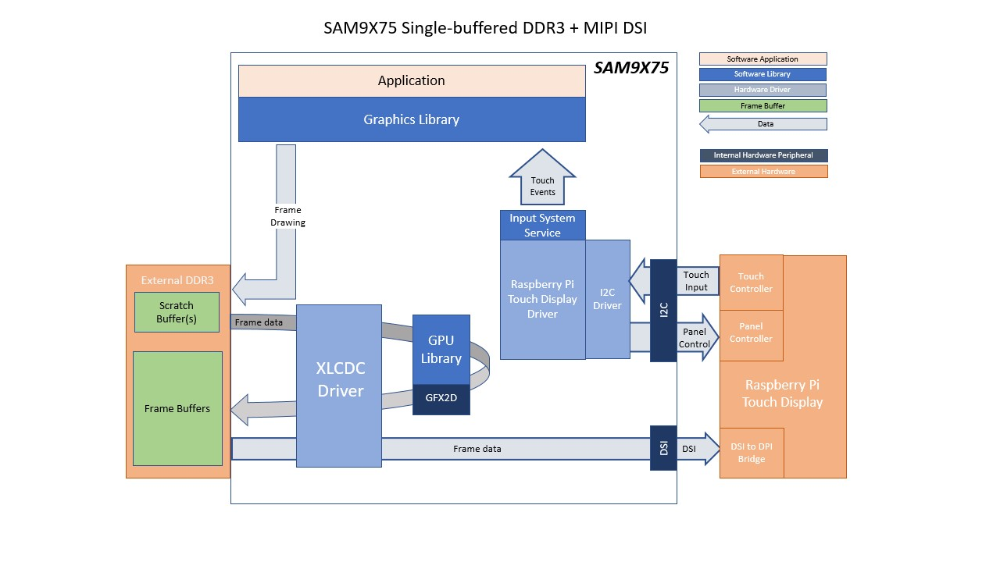
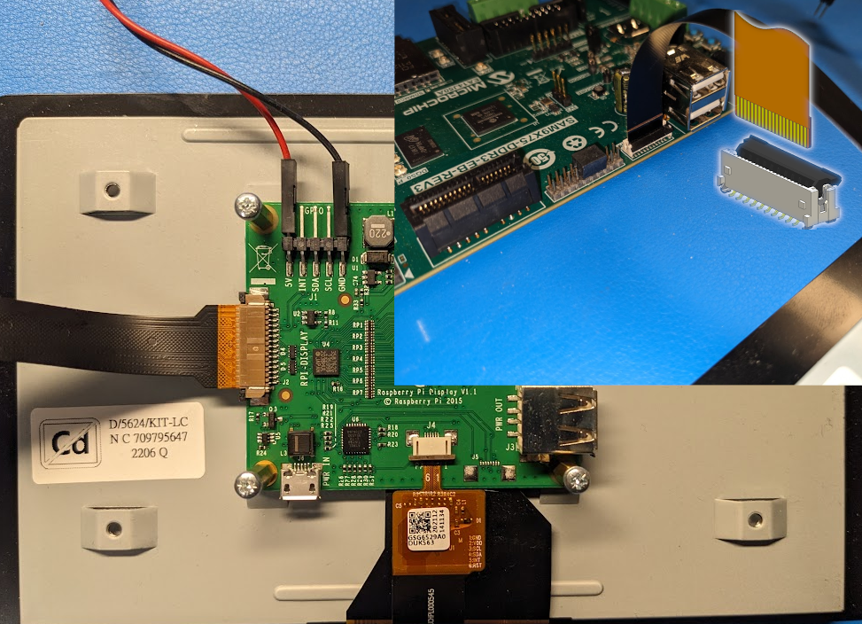
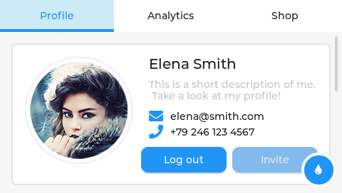

lvgl_sc_9x75_eb_rpi_7inch.X

Defining the Architecture
-------------------------

This application demonstrates single-layer WVGA graphics using DDR3 memory.

User touch input on the display panel is received through the capacitive touch controller, which sends a notification to the Touch Input Driver. The Touch Input Driver reads the touch information over I2C and sends the touch event to the Graphics Library through the Input System Service.

### Demonstration Features

-   Legato Graphics Library
-   Reference application for the SAM9X75-DDR3-EB Early Access Evaluation Board
-   24-bit color, single-layer, WVGA (800x480) screen design
-   Time system service, RTT peripheral library and driver
-   Graphics Acceleration using integrated display controller (XLCDC)
-   GFX2D GPU Driver Support
-   Raspberry Pi Touch Display driver

Creating the Project Graph
--------------------------

The Project Graph diagram shows the Harmony 3 components that are included in this application. Lines between components are drawn to satisfy components that depend on a capability that another component provides.

Adding the **SAM 9X75 Evaluation Board BSP** and **Legato Graphics w/ RPi Touch Display** Graphics Template component into the project graph will automatically add the components needed for a graphics project and resolve their dependencies. It will also configure the pins needed to drive the external peripherals like the display and touch controller.

Building the Application
------------------------

The parent directory for this application is gfx/apps/lvgl\_showcase. To build this application, use MPLAB X IDE to open the gfx/apps/lvgl\_showcase/firmware/lvgl\_sc\_9x75\_eb\_rpi_7inch.X project folder and press F11.
A successful build will generate a harmony.bin file in dist/dsi_xlcdc_rgba8888_rpi_9x75_wvga/production in the project folder.

The following table lists configuration properties:

|Project Name|BSP Used|Graphics Template Used|Description|
|:-----------|:-------|:---------------------|:----------|
|lvgl\_sc\_9x75\_eb\_rpi_7inch.X|[SAM 9X75 Evaluation Board BSP](https://www.microchip.com/en-us/development-tool/EA14J50A) |LVGL Graphics w/ RPi Touch Display|[SAM9X75-DDR3-EB Early Access Evaluation Board](https://www.microchip.com/en-us/development-tool/EA14J50A) and [Raspberry Pi Touch Display](https://www.raspberrypi.com/products/raspberry-pi-touch-display/) MIPI DSI Display|

> **NOTE:** This application may contain custom code that is marked by the comments // START OF CUSTOM CODE ... and // END OF CUSTOM CODE. When using the MPLAB Code Configurator to regenerate the application code, do not remove or replace the custom code.

Configuring the Hardware
------------------------

Configure the hardware as follows:
-   Connect the power pins of the Raspberry Pi Touch Display (5V and GND) to the SAM9X75 Evaluation Board's mikroBus header using jumpers as shown in the image below.

-   Connect the display to the evaluation board using a [22-pin to 15-pin DSI FFC cable](https://www.waveshare.com/dsi-cable-15cm.htm). Connect the 15-pin side to the display with the contacts facing up and the 22-pin side with the contacts facing away from flip-lock as shown in the image.

-	Take an SD Card formatted with the FAT32 file system and copy the boot.bin binary file from this [location](./binaries/boot.bin). Also copy the harmony.bin file you generated from the "Building the Application" section.

-   Insert the SD card into the SDMMC0 slot on the SAM9X75-DDR3-EB Early Access Evaluation Board and power up the board by connecting a USB cable (5V/1A recommended) to the USB port or an adapter to the barrel jack (5V/1A recommended, Center Positive).

Running the Demonstration
-------------------------

**About the Demonstration**

The LCD should display a simple menu with images, text, and a button on successful power-on. See reference image.
   

* * * * *
